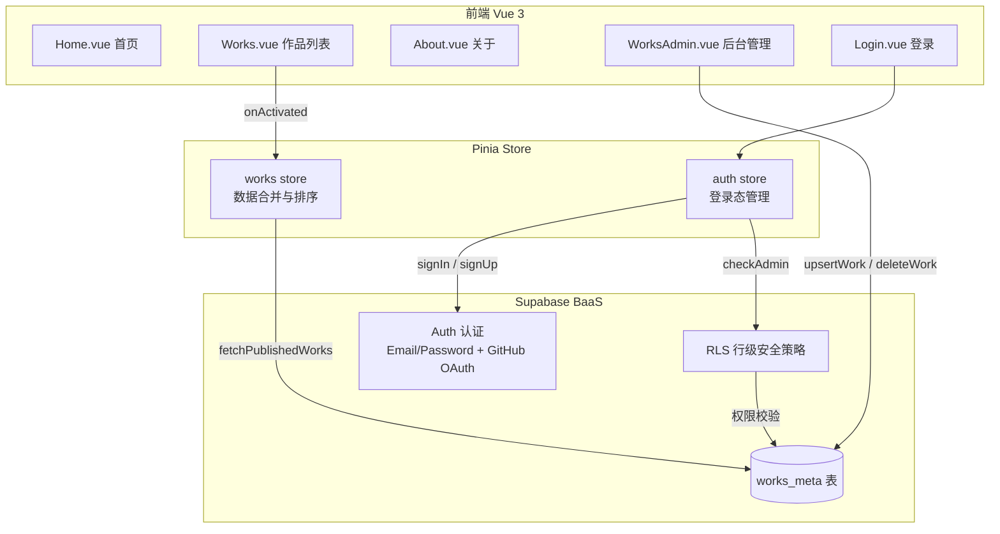
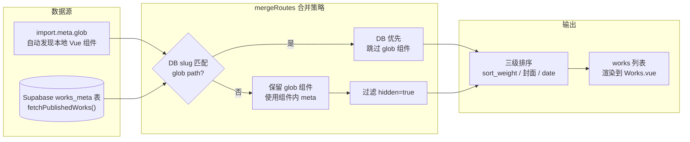
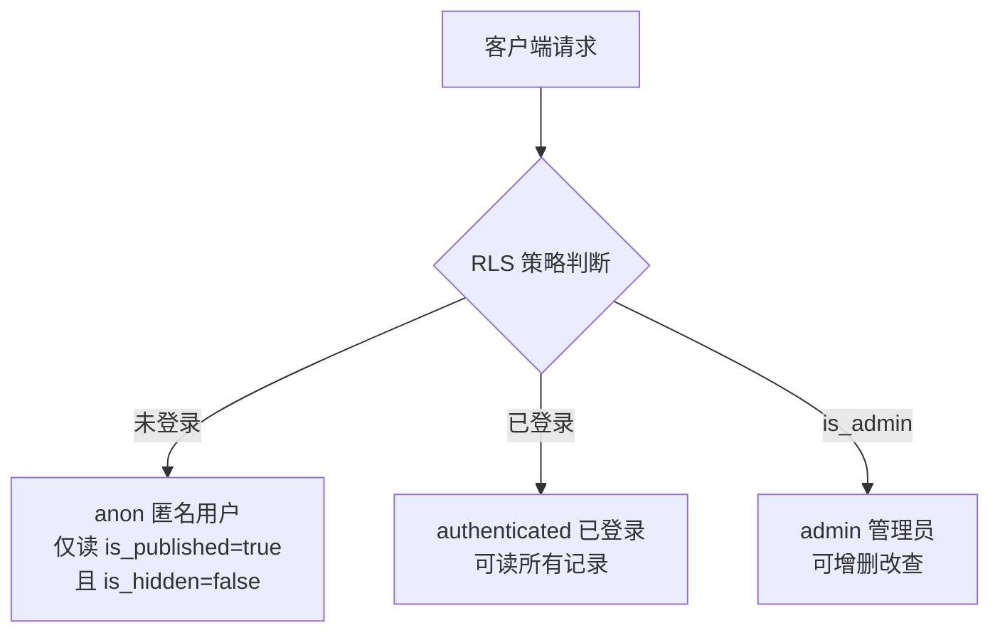

# 个人作品展示

这是一个开源的个人展示项目（主 `Vue3 + TailwindCSS + Supabase`），里面记录了自己遇到和总结的有意思的小玩意。经过不断优化和迭代，页面变得更加简约和美观，可以用于对外展示或者添加到简历当中🎉。

<center></center>
<center></center>

作品目录主要通过遍历 `works` 文件目录，将二级目录下所有功能添加到路由当中。同时接入了 **Supabase** 作为后端服务，支持在线管理作品元数据（封面、描述、排序等），实现内容更新无需重新部署。假如你习惯在 `codepen` 等在线平台编写代码，也可以通过在 [src/settings.js](https://github.com/sunwenxu1997/sunwenxu1997.github.io/blob/main/src/settings.js) 中配置外部路由 `externalRoutes`，帮你更好的展示👍。

如果更帮助到大家，也欢迎在 [issues](https://github.com/sunwenxu1997/sunwenxu1997.github.io/issues) 提出修改意见🙏。

## 技术栈

| 分类 | 技术 |
| --- | --- |
| 框架 | Vue 3 + Vite |
| 样式 | TailwindCSS + Sass |
| 状态管理 | Pinia |
| 路由 | Vue Router |
| 后端/BaaS | Supabase（Auth + Database + RLS） |
| 动画 | GSAP + Anime.js |
| 3D 渲染 | Three.js |
| UI 组件 | Element Plus |
| 网络请求 | Axios |
| 部署 | GitHub Pages（GitHub Actions 自动构建） |

### 移动端适配
基于 `tailwindcss` 实现的移动端适配，所以不用担心在手机上的展示问题。

<center></center>

### 作品搜索
你可以在作品栏中通过 `长按鼠标左键` 实现内容的搜索，即便这是一个可以悬浮移动的搜索框，maybe 还有一点点小小的bug！🍕

<center></center>

## 整体架构



## Supabase 集成

项目使用 [Supabase](https://supabase.com/) 作为后端服务，主要提供 **用户认证** 和 **作品数据管理** 两项能力。

### 环境配置

在项目根目录创建 `.env.local` 文件，填入你的 Supabase 项目凭证：

```env
VITE_SUPABASE_URL=https://<your-project>.supabase.co
VITE_SUPABASE_PUBLISHABLE_KEY=<your-anon-or-publishable-key>
```

### 作品数据来源与合并

作品列表由 **本地 Vue 组件** 和 **Supabase 数据库** 两个数据源合并而成，合并逻辑在 `stores/works.js` 中实现：



### 数据库表结构（works_meta）

| 字段 | 类型 | 描述 |
| --- | --- | --- |
| slug | text (unique) | 路由标识，如 `/external/vue-组件页面装修demo` |
| name | text | 作品标题 |
| cover_url | text | 封面图地址 |
| info_html | text | 内容描述（支持 HTML） |
| code_url | text | GitHub 代码地址 |
| link_url | text | 文章链接地址 |
| codepen_url | text | CodePen 在线代码地址 |
| open_url | text | 外部打开地址 |
| sort_weight | int | 排序权重（越大越靠前） |
| date | date | 发布日期 |
| tags | text[] | 标签 |
| is_published | bool | 是否已发布 |
| is_hidden | bool | 是否隐藏 |

### RLS 安全策略



### 认证方式

项目支持两种登录方式，用于后台管理（`/admin/works`）的权限校验：

- **邮箱密码登录** — `signInWithPassword({ email, password })`
- **GitHub OAuth** — `signInWithOAuth({ provider: 'github' })`

路由守卫（`router/index.js`）会在进入管理页面前校验登录态和管理员权限，未授权用户自动跳转 `/login`。

## 结构目录

```
|-- .env.local              // 环境变量（Supabase 凭证，不提交到 Git）
|-- .github/workflows/      // GitHub Actions CI/CD
|-- tailwind.config.js      // Tailwind 配置
|-- vite.config.js          // Vite 配置
|-- tsconfig.json           // TypeScript 配置
|-- public/                 // 静态资源
|-- src/
    |-- settings.js         // 设置项（externalRoutes 外部路由配置）
    |-- lib/
    |   |-- supabase.js     // Supabase 客户端初始化
    |-- api/
    |   |-- works.js        // works_meta 表 CRUD 封装
    |-- stores/
    |   |-- auth.js         // 认证状态管理
    |   |-- works.js        // 作品数据合并 & 排序
    |-- assets/             // 静态资源（图片、样式、JS 工具）
    |-- components/         // 公共组件
    |-- router/
    |   |-- index.js        // 路由配置 + 守卫
    |   |-- works.js        // 作品路由自动生成
    |-- utils/
    |-- views/
        |-- Home.vue        // 首页
        |-- Works.vue       // 作品列表
        |-- About.vue       // 关于
        |-- Login.vue       // 管理员登录
        |-- admin/
        |   |-- WorksAdmin.vue  // 后台管理
        |-- works/          // 作品目录，可自定义分类
            |-- cssHtml/
            |-- gsap/
            |-- anime/
            |-- svg/
            |-- three/
            |-- other/
```

### 作品配置
其中 `router/works.js` 为作品目录的配置：

| 字段 | 描述 |
| --- | --- |
| path | 功能代码地址 |
| name | 标题（项目内文件无需配置，自动匹配当前文件名） |
| code | github 代码地址（项目内文件无需配置，自动匹配当前文件路径） |
| link | 掘金文章地址 |
| cover | 封面图 |
| info | 内容信息描述 |
| sort | 排序数值越大越靠前 |
| date | 日期（年月日） |

<center></center>

## 项目启动

### 安装依赖

```sh
npm install
```

### 配置环境变量

复制并编辑 `.env.local`，填入你的 Supabase 项目信息：

```sh
cp .env.local.example .env.local
# 编辑 .env.local 填入 VITE_SUPABASE_URL 和 VITE_SUPABASE_PUBLISHABLE_KEY
```

### 运行

```sh
npm run dev
```

### 部署

```sh
npm run build
```

项目已配置 GitHub Actions，推送到 `main` 分支后会自动构建并部署到 GitHub Pages。
